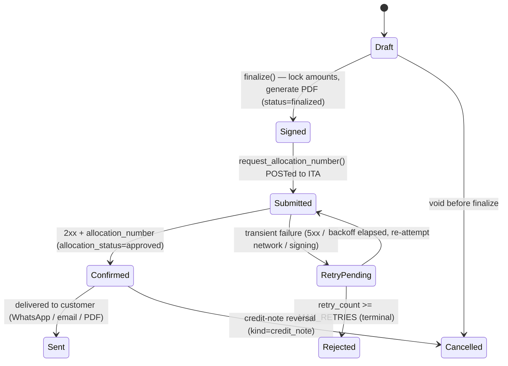

# M1 Ecosystem Completion — Architectural & Technical Specification

> **Status:** Blueprint (strategic pivot). M2 / Core-AI development is **PAUSED**; 100% focus on **M1** =
> the Tax, Billing & Accounting engine (`services/aurora-main-api`, `app.main:app`, image `aurora/api`).
> **Audience:** Backend, DevOps, and Frontend agents completing the M1 end-to-end.
> **Grounding:** Every section is anchored to current code (file:line) and separates *what exists today*
> from *the delta to "done"*.

---

## 0. Scope & baseline

M1 is a state-managed invoice/tax engine with:
- a **dual finalization path** — synchronous (REST) and asynchronous (retry queue),
- an **RS256-signed Israel Tax Authority (ITA) integration** for allocation numbers,
- an **append-only audit trail** with a daily **tamper-evident BigQuery export**,
- an **accountant portal surface** (OTP/device auth, KPIs, the per-client "book", document vault, exports,
  chart-of-accounts mapping).

The shared data layer lives in `shared_packages/aurora_shared/aurora_shared/database/models.py`; the service
code is under `services/aurora-main-api/app/`.

Production-readiness is gated by `app/config/backend_check.py` (`_HARD_FAIL`): in `cloud_run` the service
refuses to boot if `ITA_BACKEND ∈ {mock,stub,""}`, `STORAGE_BACKEND ∈ {stub,""}`, or
`AUDIT_BIGQUERY_BACKEND ∈ {stub,""}`. Storage + audit are solved in prod; **ITA is the last hard blocker**.

---

## 1. The Invoicing Lifecycle & State Machine

### 1.1 Data model (current)
`Invoice` (`models.py` ~L95–198) carries **two orthogonal state fields** plus ITA metadata:

| Field | Values | Meaning |
|---|---|---|
| `status` | `draft → finalized → sent → cancelled` | Document lifecycle |
| `allocation_status` | `pending`, `approved`, `failed`, `retry_pending`, `not_required` | ITA allocation sub-state |
| `requires_allocation` | `0/1` | Whether an ITA number is mandated (amount/threshold) |
| `allocation_number` | 9-digit str / null | ITA-issued number (on approval) |
| `allocation_issued_at` | datetime / null | When approved |
| `allocation_retry_count` | int | Retries attempted |
| `allocation_next_retry_at` | datetime / null | Next backoff slot |
| `ita_request_id` | str / null | Idempotency key sent to ITA |
| `ita_status_code` | int / null | HTTP status of last ITA call |
| `ita_response_raw_json` | str / null | Sanitised ITA response (no PII) |
| `kind` | `standard` \| `credit_note` | Credit notes carry negative amounts + `original_invoice_id` |

### 1.2 Canonical state machine (target — the Draft → Signed → Submitted → Confirmed/Rejected model)



**Mapping conceptual → code, with the completion delta:**

| Stage | Current reality | Delta to "done" |
|---|---|---|
| **Draft** | `status='draft'`, `allocation_status='pending'`; `create_draft_invoice` (`invoice_service.py`) | — |
| **Signed** | `finalize_invoice` (`invoice_service.py` ~L281) locks the invoice, sets `finalized_at` + `due_date=+30d`, generates the PDF. The *request* is RS256-signed; the *document* is not. | Decide whether "Signed" stays = finalize+PDF, or add a true cryptographic invoice signature (`signed_at` + artifact) **before** submission if regulation requires it. |
| **Submitted** | Allocation request POSTed inside finalize; `allocation_status` transitions on the response. No distinct "submitted" marker. | Add `allocation_submitted_at` so the UI can show "awaiting ITA" vs "not yet sent". |
| **Confirmed** | `allocation_status='approved'` + `allocation_number` stored + `status='finalized'` | — |
| **Rejected** | After terminal retries `allocation_status='failed'`; invoice stays non-finalized and effectively **stuck**. | Introduce an explicit terminal `rejected` (distinct from transient `failed`), surfaced to the accountant + an admin requeue/cancel path. |
| **Sent** | Documented but **never set in code**. | Set `status='sent'` on delivery (`/send-whatsapp`, email). |
| **Cancelled** | Documented but **no logic**. | Implement void + credit-note linkage. |

**Completion deliverable:** centralize transitions in a single `invoice_service.transition(invoice, event)`
helper (allowed-transition table + side-effects + audit row), replacing today's ad-hoc `status = ...` writes.

### 1.3 Finalization flows (current)
- **Sync (REST):** `POST /api/v1/invoices` → draft → `POST /api/v1/invoices/{id}/finalize`. Guard: only `draft`
  may finalize (`InvoiceStateError`). Resolves seller tax id → `request_allocation_number` → on success store
  number + `approved` + lock; on failure `allocation_status='failed'` + raise `AllocationFailedError`
  (router returns **502**). PDF generation is non-fatal.
- **Async retry queue (`allocation_queue.py`):** background loop every 30s selects invoices due for retry
  (`allocation_next_retry_at <= now`, `retry_count < MAX_RETRIES = 10`); on success finalizes + notifies the
  user (Telegram/WhatsApp); on failure schedules the next slot with **exponential backoff**
  `[30s, 2m, 10m, 1h × 7]` (`RETRY_DELAYS`). After 10 failures the user is told to contact support and the
  invoice currently remains pending → **the "stuck forever" gap §1.2 closes**.

---

## 2. Israel Tax Authority (ITA) Production Integration

### 2.1 Module layout (`app/services/ita/`)
- `__init__.py` — public surface (`request_allocation_number`, `ITA_BACKEND`, `ITA_API_BASE`, `ITAClientError`);
  all callers import from here.
- `client.py` — dispatches on `ITA_BACKEND`: `mock` (≈95% success, CI/dev) vs `production` (`_production_call`).
- `auth.py` — RS256 JWT signing + `build_request_id`.
- `vat_filing.py` — bi-monthly VAT returns, reuses the same auth (kept on `stub` for this cutover).

### 2.2 Authentication — RS256 JWT (`auth.py`)
| Claim | Source |
|---|---|
| `iss` | `ITA_SOFTWARE_HOUSE_ID` (env, **required**) |
| `sub` | seller tax id |
| `aud` | `ITA_AUDIENCE` (default `ita.gov.il`) |
| `iat` / `exp` | now / now + `ITA_JWT_TTL_SECONDS` (default **300s**) |
| `jti` | `request_id` (idempotency key) |

- **Algorithm:** RS256. **Private key:** PEM RSA loaded via `get_secret(ITA_PRIVATE_KEY_SECRET)`
  (default secret name `AURORA_ITA_PRIVATE_KEY`) → GCP Secret Manager in prod, env fallback in dev.
- **Missing key / software-house-id:** raises; in production this **fails the allocation, not the boot** — the
  invoice queues for retry and an audit row is written with `success=False`.

### 2.3 Idempotency
`request_id = "{invoice_id}:{retry_count}:{uuid[:8]}"` — deterministic per (invoice, retry). Sent both as the
`X-Request-Id` header and as the JWT `jti`. ITA's duplicate-detection returns the original allocation on replay,
so **retries never double-allocate**.

### 2.4 Production HTTP call (`client.py::_production_call`)
- `POST {ITA_API_BASE}{ITA_ALLOCATION_PATH}` (defaults `https://ita.gov.il/api` + `/allocation/v1/issue`).
- Headers: `Authorization: Bearer <jwt>`, `Content-Type: application/json`, `X-Request-Id`,
  `User-Agent: Aurora-LTS/1.0`.
- Timeout: `ITA_TIMEOUT_SECONDS` (default 15s, `httpx.AsyncClient`).
- **2xx** → extract `allocation_number`, `success=True`. **4xx/5xx/network/signing** → `success=False` with
  status + sanitised message. Return includes `latency_ms`, `http_status`, `backend`, `raw_response_summary`
  (≤500 chars, no PII).

### 2.5 Audit (always written) → `ita_audit_log`
Every call (mock/prod, success/fail) writes a row: `request_id`, `operation`, `seller/buyer_tax_id_masked`
(first-3 + last-2 digits), `amount_minor_units` (agorot), `currency`, `http_status`, `latency_ms`, `success`,
`allocation_number`, `error_code/message`, `backend`, `response_summary`. **Best-effort** (a DB failure never
throws). The row is **append-only** (§3.3).

### 2.6 Production cutover (compliance-gated) — the primary remaining M1 blocker
Enabling `ITA_BACKEND=production` means **real ITA allocations** — requires business/regulatory sign-off + the
ITA-issued software-house id + private key. **Do not enable unilaterally.** Reuse
`docs/runbooks/v0.2.4-real-backends-cutover.md`.

**Env / secret payload** (`gcloud run services update aurora-api …`):

| Var / Secret | Value | Notes |
|---|---|---|
| `ITA_BACKEND` | `production` | HARD-FAIL today (`mock`) |
| `ITA_SOFTWARE_HOUSE_ID` | ASG's ITA registration id | **required, currently missing** — JWT `iss` |
| `ITA_PRIVATE_KEY_SECRET` → secret `AURORA_ITA_PRIVATE_KEY:latest` | PEM RSA private key | `--update-secrets`; grant `aurora-run@…` `roles/secretmanager.secretAccessor` |
| `ITA_API_BASE` / `ITA_ALLOCATION_PATH` / `ITA_AUDIENCE` / `ITA_JWT_TTL_SECONDS` / `ITA_TIMEOUT_SECONDS` | defaults | OK |
| `VAT_FILING_BACKEND` | `stub` | VAT filing out of scope for this cutover |
| `STORAGE_BACKEND` / `GCS_BUCKET_RECEIPTS` | `gcs` / `aurora-lts-prod-secure-storage` | already solved |
| `AUDIT_BIGQUERY_BACKEND` / `GOOGLE_CLOUD_PROJECT` / `BIGQUERY_AUDIT_DATASET` | `gcp` / `aurora-lts-prod` / `asg_audit` | already solved |

```bash
gcloud secrets create AURORA_ITA_PRIVATE_KEY --data-file=ita_private_key.pem --project=aurora-lts-prod
gcloud secrets add-iam-policy-binding AURORA_ITA_PRIVATE_KEY \
  --member=serviceAccount:aurora-run@aurora-lts-prod.iam.gserviceaccount.com \
  --role=roles/secretmanager.secretAccessor
```

**Cutover sequence:** set env+secret → build via `cloudbuild_verify.yaml` (import-gate + lifespan-gate) →
deploy **no-traffic candidate** → **boot gate** (logs: `Server is ready`, `backend_check` passes) → gated
**10 → 50 → 100** with synthetic load through the public LB → **rollback** on 5xx → tag `v0.2.4`.

**Fallback / degradation:** ITA unreachable → invoice queues + retries (backoff §1.3); user notified
asynchronously; terminal after `MAX_RETRIES` → manual admin (close the `rejected` gap §1.2).

---

## 3. Accountant & Bureaucracy Workflows + Immutable Audit Trail

### 3.1 Auth & device binding (`app/routers/accountant_auth.py`)
- **OTP:** 6-digit, 60s TTL, 3 attempts → 15-min lockout, SHA-256 hashed (plaintext never stored),
  ≤3 sends / email / 15-min.
- **Access token:** HS256 JWT, 15-min, `iss=aurora-accountant`, claims `sub/email/device_id/role=accountant`.
- **Refresh token:** opaque 64-char, 30-day, SHA-256 hashed, **rotated on every `/refresh`** with
  **replay detection** — reuse of a consumed token revokes the whole chain + raises a CRITICAL alert.
- **Device binding:** fingerprint / platform / label / IP-hash; revoke cascades to refresh tokens.

### 3.2 Portal-facing endpoints (the M1 surface the CEO Dashboard consumes via `apiM1`)

| Endpoint | Auth | Purpose |
|---|---|---|
| `GET /api/v1/accountant/dashboard/kpis` | `require_accountant` | vault_docs_this_month, active_clients, active_devices, security_status |
| `GET /api/v1/accountant/book` | `_require_accountant_or_admin` | per-engaged-org grid: invoice_count, outstanding_amount, review_queue_count, last_activity |
| `… /vault/clients/{id}/documents[/manual]` | `require_accountant` + engagement | list + manual upload (≤25 MB; 7-year retention via CHECK constraints; sha256; GCS or stub) |
| `POST/GET /api/v1/accountant/orgs/{id}/exports`, `GET …/exports/{id}` | `require_accountant` + engagement | `uniform_file` / `hashavshevet` export → GCS signed URL |
| `GET/PUT /api/v1/accountant/coa-mappings` | `require_accountant` | category → chart-of-accounts code (unique per accountant+category) |
| `… /accountant/devices[...]` | `require_accountant` | list / revoke / relabel bound devices |

> **Auth ceiling (important):** the portal authenticates as **accountant-role**. The raw founder invoice/receipt
> routes (`GET /api/v1/invoices`, `/organizations/{id}/receipts`) sit behind `get_current_user` +
> business-owner/admin filters, and M2's copilot is `require_admin` + IAP + step-up. The cockpit therefore
> surfaces M1 **accountant** data (KPIs + book) and M2 **health posture** only — see §4.

**Completion work (frontend, M1-focused):** build the book grid → per-client drill-down (vault browser, export
generator + signed-URL download, COA-mapping editor, period tax reports), all via `apiM1` + `m1Key`.

### 3.3 Immutability guards (`app/services/compliance/immutability.py`)
- **Blanket append-only** (UPDATE/DELETE blocked): `ItaAuditLog`, `ActionLog`.
- **Status-based** (immutable once terminal): `RevenueShareLedger` / `AccountantPayout` once `paid`,
  `SubscriptionPayment` once `succeeded`.
- **Mechanism:** SQLAlchemy `before_update` / `before_delete` event listeners (mirrors prod Postgres triggers so
  dev/SQLite behaves identically) raising `ImmutableRowError`. Override only via
  `AURORA_AUDIT_ALLOW_OVERRIDE=1` (rare admin ops).

### 3.4 Immutable audit trail → BigQuery (`app/services/compliance/bigquery_export.py`)
- **Cadence:** daily `0 2 * * *` (Cloud Scheduler) → `POST /api/v1/internal/audit-export`
  (`app/routers/internal.py`), authenticated by internal shared token **or** Google OIDC allowlist.
- **Flow:** read `action_logs` + `ita_audit_log` `WHERE id > cursor.last_exported_id` (batch 1000) → **redact
  PII** (phone / email / tax-id regex) + ISO-format datetimes → build a **tamper-evident hash chain**
  `batch_hash = sha256(prev_hash + Σ row_hashes)` stored in `AuditExportCursor.last_batch_hash` → insert via
  `insert_rows_json` (backend `AUDIT_BIGQUERY_BACKEND=gcp`, dataset `BIGQUERY_AUDIT_DATASET=asg_audit`) or NDJSON
  stub → advance cursor atomically. Any past-row tampering breaks the chain on auditor replay.
- **Completion work (team):** create BigQuery tables `asg_audit.action_logs` + `asg_audit.ita_audit_log` (export
  404s without them; does **not** block boot); add an auditor "replay & verify chain" CLI.

---

## 4. System Harmony — CEO Dashboard orchestration with M2 paused
- The CEO Dashboard (Founder's Cockpit) drives **M1 via `apiM1`** (KPIs + the accountant book, and the planned
  per-client drill-downs) and keeps a **live but minimal M2 touchpoint via `apiM2`** — the open
  `/api/v1/core/health` posture probe. Per-engine React Query caches (`m1Key` / `m2Key`), per-pane error
  boundaries, and concurrent 15s health probes keep the engines isolated. A single keychain JWT is intentionally
  accepted by both (shared DB + JWT secret) — that is shared identity, **not** cross-contamination, because each
  engine-bound client has a base URL fixed at construction and exposes no per-call `engine` switch.
- **M2 frozen:** no new M2 endpoints/features this phase; the M2 pane shows reachability + compliance posture
  only, copilot disabled behind its `admin + IAP + step-up` note. M2 stays deployed and health-probed.

### Roadmap to "M1 done"
1. **Phase 1 dual-wiring** — *done* (`apiM2` posture + `apiM1` book).
2. **Accountant book drill-down** — vault browser, exports + signed-URL download, COA editor, period tax reports.
3. **ITA production cutover** — compliance-gated (§2.6).
4. **BigQuery audit tables + chain-verify tooling** (§3.4).
5. **Lifecycle completion** — explicit `submitted`/`rejected`/`sent`/`cancelled` + the central `transition()` helper (§1.2).
6. **VAT filing productionization** — flip `VAT_FILING_BACKEND` (later, separate sign-off).

---

## 5. Out of scope / gates
- **ITA regulatory sign-off + credentials** (business) — blocks §2.6.
- **BigQuery audit-table creation** (team) — §3.4.
- **M2 / Core-AI feature work** — paused by directive.
- **`v0.2.4` git tag** — deferred until M1 also cuts over (tag = both engines on v0.2.4).
